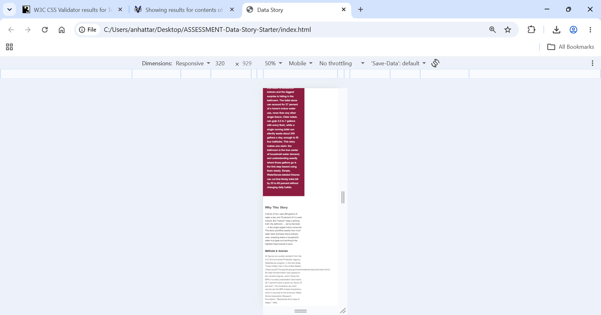
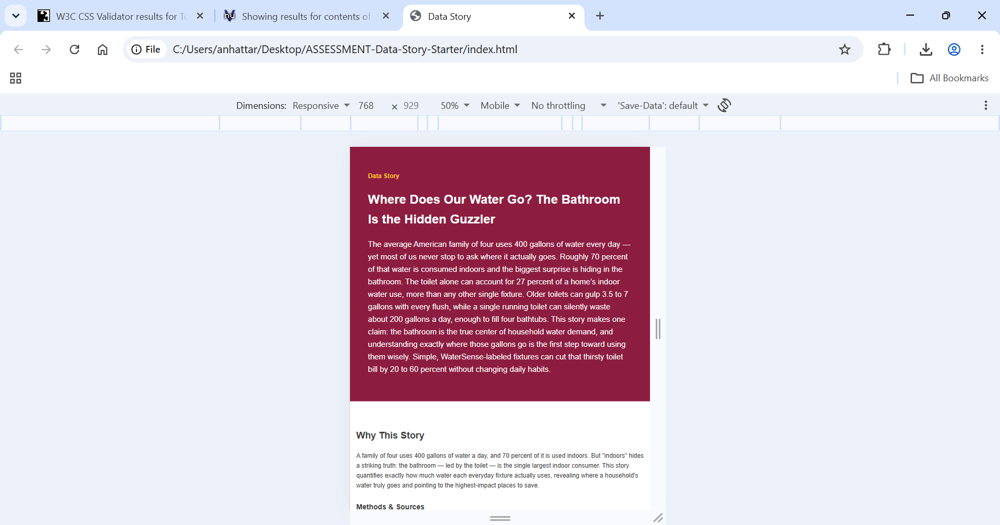
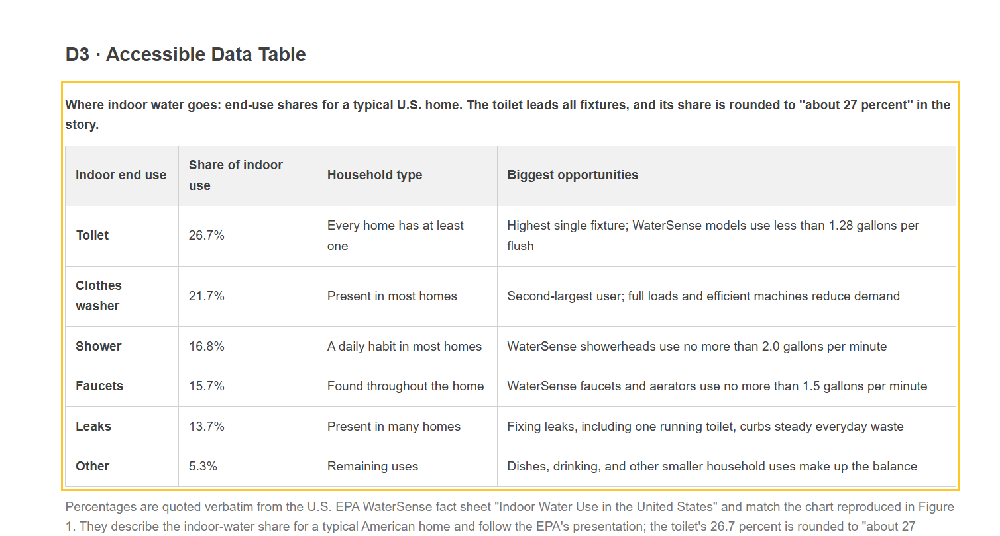

# Test Record — Where Does Our Water Go?

**Published page:** https://ahattar10.github.io/-ASSESSMENT-Data-Story-Starter/

All tests performed in [Browser name, e.g. Chrome] on [OS, e.g. Windows/macOS].

---

## 1. HTML & CSS Validation
Validated with the W3C Validator. No errors.
- HTML: 
- CSS: 

## 2-4. Viewport Checks (320px / 768px / 1280px)
Resized in responsive mode to confirm layout, figures, table, and SVG stay usable with no horizontal overflow.
- 320px: 
- 768px: 
- 1280px: 

## 5. 200% Zoom / Reflow
Zoomed the page to 200%; content reflowed without cutting off text or losing access.

## 6. Keyboard Access + Overflowing Table Region
Navigated with the Tab key through all interactive elements; the data table's scrollable region is reachable and scrollable via keyboard.

## 7. Accessibility-Tree Inspection (figure, table, SVG)
Inspected the accessibility tree; each figure, the table, and the SVG expose a correct accessible name and structure.

## 8. Image-Disabled Review
Disabled images; alternative text and figure captions preserve the meaning of each figure.

---

## Source-to-Page Spot Check (data verification)
Three or more values cross-checked against the cited U.S. EPA WaterSense fact sheet:
- 400 gallons / family of four / day — verified
- Toilet at about 27% of indoor use (26.7%) — verified
- Running toilet wastes ~200 gallons/day — verified
- Showerhead ~2.5 gal/min; faucet ~2 gal/min — verified
